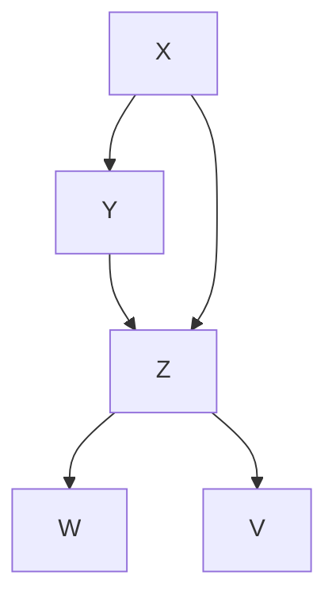

## Introduction to causal methods and problems

```mermaid
    graph TB
    X --> Y --> Z
    X --> Z
    Z --> W
    Z --> V
```

## second slide

* one
* two 

$\sqrt{3} = 4/3$

$$
4 = \frac{1}{2}
$$

